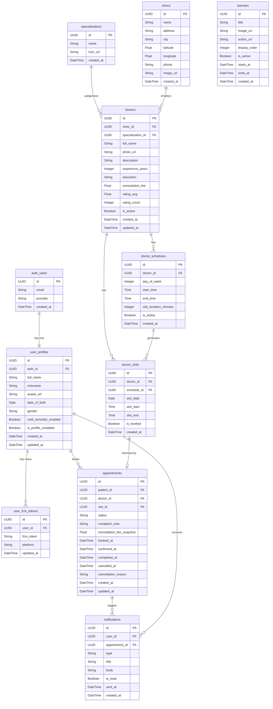

# Entity Relationship Diagram
## health_pal — Doctor Appointment Mobile Application

| Field | Detail |
|---|---|
| **Project** | health_pal |
| **Backend** | Supabase (PostgreSQL) |
| **Versi Dokumen** | v1.0 |
| **Tanggal** | Juni 2026 |
| **Dibuat oleh** | Senior Database Architect |

---

## Daftar Isi

1. [Diagram ERD (Mermaid)](#1-diagram-erd-mermaid)
2. [Deskripsi Entitas & Atribut](#2-deskripsi-entitas--atribut)
3. [Relasi Antar Tabel](#3-relasi-antar-tabel)
4. [Catatan Desain & Keputusan Arsitektur](#4-catatan-desain--keputusan-arsitektur)
5. [Mapping ke Dart Data Model](#5-mapping-ke-dart-data-model)
6. [Supabase RLS Policy (Ringkas)](#6-supabase-rls-policy-ringkas)
7. [Index yang Direkomendasikan](#7-index-yang-direkomendasikan)

---

## 1. Diagram ERD (Mermaid)



---

## 2. Deskripsi Entitas & Atribut

---

### `auth_users`
> Tabel milik Supabase Auth (`auth.users`). **Tidak dibuat manual** — otomatis dikelola Supabase. Direferensikan oleh `user_profiles` via FK.

| Kolom | Tipe | Keterangan |
|---|---|---|
| `id` | `UUID` PK | Auto-generated oleh Supabase Auth |
| `email` | `TEXT` | Email login user |
| `provider` | `TEXT` | `email` atau `google` |
| `created_at` | `TIMESTAMPTZ` | Waktu registrasi |

---

### `user_profiles`
> Data profil pasien. Diisi saat onboarding pertama kali. One-to-one dengan `auth_users`.

| Kolom | Tipe | Keterangan |
|---|---|---|
| `id` | `UUID` PK | `DEFAULT gen_random_uuid()` |
| `auth_id` | `UUID` FK | Referensi ke `auth.users.id` |
| `full_name` | `TEXT` | Nama lengkap pasien |
| `nickname` | `TEXT` | Nama panggilan (dipakai di greeting) |
| `avatar_url` | `TEXT` | URL foto profil di Supabase Storage |
| `date_of_birth` | `DATE` | Tanggal lahir |
| `gender` | `TEXT` | Enum: `male`, `female`, `other` |
| `notif_reminder_enabled` | `BOOLEAN` | Toggle reminder FCM, default `true` |
| `is_profile_complete` | `BOOLEAN` | Flag cek onboarding selesai, default `false` |
| `created_at` | `TIMESTAMPTZ` | Auto |
| `updated_at` | `TIMESTAMPTZ` | Auto update via trigger |

---

### `user_fcm_tokens`
> Menyimpan FCM token per device per user. Satu user bisa punya banyak token (multi-device).

| Kolom | Tipe | Keterangan |
|---|---|---|
| `id` | `UUID` PK | |
| `user_id` | `UUID` FK | Referensi ke `user_profiles.id` |
| `fcm_token` | `TEXT` | Token FCM dari Firebase SDK |
| `platform` | `TEXT` | Enum: `android`, `ios` |
| `updated_at` | `TIMESTAMPTZ` | Diperbarui setiap login (UPSERT) |

---

### `specializations`
> Master data spesialisasi dokter. Dipakai untuk filter di Loc tab dan kategori.

| Kolom | Tipe | Keterangan |
|---|---|---|
| `id` | `UUID` PK | |
| `name` | `TEXT` | Contoh: `Umum`, `Anak`, `Kulit`, `Gigi` |
| `icon_url` | `TEXT` | URL ikon spesialisasi |
| `created_at` | `TIMESTAMPTZ` | Auto |

---

### `clinics`
> Data klinik atau rumah sakit tempat dokter berpraktik.

| Kolom | Tipe | Keterangan |
|---|---|---|
| `id` | `UUID` PK | |
| `name` | `TEXT` | Nama klinik / RS |
| `address` | `TEXT` | Alamat lengkap |
| `city` | `TEXT` | Kota (untuk filter kasar sebelum PostGIS) |
| `latitude` | `FLOAT8` | Koordinat untuk query radius di Loc tab |
| `longitude` | `FLOAT8` | Koordinat untuk query radius di Loc tab |
| `phone` | `TEXT` | Nomor telepon klinik |
| `image_url` | `TEXT` | Foto klinik |
| `created_at` | `TIMESTAMPTZ` | Auto |

---

### `doctors`
> Data dokter. Berelasi ke klinik dan spesialisasi. Kolom `rating_avg` dan `rating_count` adalah **denormalized field** — di-update via trigger saat ada ulasan baru (efisien untuk read di mobile).

| Kolom | Tipe | Keterangan |
|---|---|---|
| `id` | `UUID` PK | |
| `clinic_id` | `UUID` FK | Referensi ke `clinics.id` |
| `specialization_id` | `UUID` FK | Referensi ke `specializations.id` |
| `full_name` | `TEXT` | Nama lengkap dokter |
| `photo_url` | `TEXT` | URL foto dokter |
| `description` | `TEXT` | Deskripsi / bio singkat |
| `experience_years` | `INT2` | Lama pengalaman (tahun) |
| `education` | `TEXT` | Riwayat pendidikan singkat |
| `consultation_fee` | `NUMERIC(12,2)` | Tarif konsultasi (snapshot disimpan juga di appointments) |
| `rating_avg` | `NUMERIC(3,2)` | Rata-rata rating (denormalized, default `0.00`) |
| `rating_count` | `INT4` | Jumlah ulasan (denormalized) |
| `is_active` | `BOOLEAN` | Soft-delete / nonaktifkan dokter |
| `created_at` | `TIMESTAMPTZ` | Auto |
| `updated_at` | `TIMESTAMPTZ` | Auto update via trigger |

---

### `doctor_schedules`
> Template jadwal mingguan dokter. Contoh: Senin–Jumat 09:00–17:00 dengan slot 30 menit. Dipakai sebagai "blueprint" untuk generate `doctor_slots`.

| Kolom | Tipe | Keterangan |
|---|---|---|
| `id` | `UUID` PK | |
| `doctor_id` | `UUID` FK | Referensi ke `doctors.id` |
| `day_of_week` | `INT2` | `0` = Minggu, `1` = Senin, ..., `6` = Sabtu |
| `start_time` | `TIME` | Jam mulai praktik |
| `end_time` | `TIME` | Jam selesai praktik |
| `slot_duration_minutes` | `INT2` | Durasi per slot (contoh: 30 menit) |
| `is_active` | `BOOLEAN` | Bisa dinonaktifkan tanpa hapus data |
| `created_at` | `TIMESTAMPTZ` | Auto |

---

### `doctor_slots`
> Slot waktu konkret per tanggal. Di-generate dari `doctor_schedules` (via Supabase cron / Edge Function), maksimal 30 hari ke depan. Mobile app query tabel ini untuk menampilkan ketersediaan.

| Kolom | Tipe | Keterangan |
|---|---|---|
| `id` | `UUID` PK | |
| `doctor_id` | `UUID` FK | Denormalized dari schedule untuk query efisien |
| `schedule_id` | `UUID` FK | Referensi ke `doctor_schedules.id` |
| `slot_date` | `DATE` | Tanggal konkret slot |
| `slot_start` | `TIME` | Jam mulai slot |
| `slot_end` | `TIME` | Jam selesai slot |
| `is_booked` | `BOOLEAN` | `true` jika sudah ada appointment aktif, default `false` |
| `created_at` | `TIMESTAMPTZ` | Auto |

> **Constraint unik:** `UNIQUE(doctor_id, slot_date, slot_start)` — mencegah double booking di level database.

---

### `appointments`
> Tabel utama untuk booking. Menyimpan snapshot `consultation_fee` saat booking dilakukan — penting agar perubahan tarif dokter di masa depan tidak mengubah histori transaksi.

| Kolom | Tipe | Keterangan |
|---|---|---|
| `id` | `UUID` PK | |
| `patient_id` | `UUID` FK | Referensi ke `user_profiles.id` |
| `doctor_id` | `UUID` FK | Denormalized untuk query efisien di Booking History |
| `slot_id` | `UUID` FK | Referensi ke `doctor_slots.id` |
| `status` | `TEXT` | Enum: `pending`, `upcoming`, `completed`, `cancelled` |
| `complaint_note` | `TEXT` | Catatan keluhan pasien (maks. 300 karakter) |
| `consultation_fee_snapshot` | `NUMERIC(12,2)` | Tarif saat booking dikonfirmasi (immutable) |
| `booked_at` | `TIMESTAMPTZ` | Waktu booking dibuat |
| `confirmed_at` | `TIMESTAMPTZ` | Waktu status berubah ke `upcoming` |
| `completed_at` | `TIMESTAMPTZ` | Waktu status berubah ke `completed` |
| `cancelled_at` | `TIMESTAMPTZ` | Waktu pembatalan |
| `cancellation_reason` | `TEXT` | Alasan batal (opsional, diisi user atau sistem) |
| `created_at` | `TIMESTAMPTZ` | Auto |
| `updated_at` | `TIMESTAMPTZ` | Auto update via trigger |

---

### `banners`
> Konten banner promo carousel di Home Screen. Dikelola manual via Supabase Dashboard atau admin panel.

| Kolom | Tipe | Keterangan |
|---|---|---|
| `id` | `UUID` PK | |
| `title` | `TEXT` | Judul banner |
| `image_url` | `TEXT` | URL gambar banner di Supabase Storage |
| `action_url` | `TEXT` | URL tujuan saat banner di-tap (deep link / web URL) |
| `display_order` | `INT2` | Urutan tampil di carousel |
| `is_active` | `BOOLEAN` | Toggle aktif/nonaktif banner |
| `starts_at` | `TIMESTAMPTZ` | Tanggal mulai tampil (nullable = langsung aktif) |
| `ends_at` | `TIMESTAMPTZ` | Tanggal berakhir (nullable = tidak ada batas) |
| `created_at` | `TIMESTAMPTZ` | Auto |

---

### `notifications`
> Riwayat notifikasi yang dikirim ke user. Berguna untuk menampilkan inbox notifikasi in-app di versi mendatang, dan sebagai audit log pengiriman FCM.

| Kolom | Tipe | Keterangan |
|---|---|---|
| `id` | `UUID` PK | |
| `user_id` | `UUID` FK | Referensi ke `user_profiles.id` |
| `appointment_id` | `UUID` FK | Referensi ke `appointments.id` (nullable) |
| `type` | `TEXT` | Enum: `booking_success`, `booking_confirmed`, `reminder_h1`, `reminder_h0`, `booking_cancelled` |
| `title` | `TEXT` | Judul push notification |
| `body` | `TEXT` | Isi pesan push notification |
| `is_read` | `BOOLEAN` | Flag sudah dibaca, default `false` |
| `sent_at` | `TIMESTAMPTZ` | Waktu pengiriman aktual |
| `created_at` | `TIMESTAMPTZ` | Auto |

---

## 3. Relasi Antar Tabel

| Relasi | Tipe | Keterangan |
|---|---|---|
| `auth_users` → `user_profiles` | One-to-One | Satu akun auth = satu profil pasien |
| `user_profiles` → `user_fcm_tokens` | One-to-Many | Satu user bisa punya token di banyak device |
| `user_profiles` → `appointments` | One-to-Many | Satu pasien bisa punya banyak riwayat booking |
| `specializations` → `doctors` | One-to-Many | Satu spesialisasi = banyak dokter |
| `clinics` → `doctors` | One-to-Many | Satu klinik = banyak dokter |
| `doctors` → `doctor_schedules` | One-to-Many | Satu dokter punya banyak template jadwal |
| `doctor_schedules` → `doctor_slots` | One-to-Many | Satu template generate banyak slot konkret |
| `doctors` → `doctor_slots` | One-to-Many | Denormalized FK untuk query slot tanpa JOIN ke schedules |
| `doctor_slots` → `appointments` | One-to-One | Satu slot hanya bisa dipesan oleh satu appointment aktif |
| `appointments` → `notifications` | One-to-Many | Satu booking bisa trigger beberapa notifikasi (booking, reminder H-1, H-0) |
| `user_profiles` → `notifications` | One-to-Many | Satu user menerima banyak notifikasi |

---

## 4. Catatan Desain & Keputusan Arsitektur

### 4.1 Pemisahan `doctor_schedules` dan `doctor_slots`
Dua tabel ini sengaja dipisah dengan pola **template → instance**:
- `doctor_schedules` = jadwal berulang mingguan (template). Diisi sekali oleh admin.
- `doctor_slots` = slot konkret per tanggal (instance). Di-generate otomatis via Supabase Edge Function / pg_cron, rolling 30 hari ke depan.

Keuntungan: mobile app cukup query `doctor_slots` dengan filter `slot_date` dan `is_booked = false` — query simpel, tidak perlu kalkulasi jadwal di sisi Flutter.

### 4.2 Denormalized `doctor_id` di `doctor_slots`
Kolom `doctor_id` ada di `doctor_slots` meskipun bisa didapat via JOIN ke `doctor_schedules`. Ini sengaja untuk **mengefisienkan query Loc tab** — cukup:
```sql
SELECT * FROM doctor_slots
WHERE doctor_id = $1
  AND slot_date = $2
  AND is_booked = false
```
Tanpa JOIN tambahan yang memperlambat response di mobile.

### 4.3 Snapshot `consultation_fee` di `appointments`
Tarif konsultasi disimpan dua kali:
1. `doctors.consultation_fee` — tarif current (bisa berubah).
2. `appointments.consultation_fee_snapshot` — tarif saat booking terjadi (immutable).

Ini penting untuk **integritas histori transaksi** — perubahan harga dokter tidak boleh mengubah data booking lama.

### 4.4 Kolom `is_booked` di `doctor_slots`
Flags sederhana ini **sengaja denormalized** dari `appointments` agar query ketersediaan slot di Detail Dokter super cepat:
```sql
SELECT * FROM doctor_slots
WHERE doctor_id = $1 AND slot_date = $2
-- Tidak perlu LEFT JOIN ke appointments
```
`is_booked` di-update via Supabase Trigger setiap kali `appointments.status` berubah ke `cancelled` (set kembali ke `false`) atau `pending`/`upcoming` (set `true`).

### 4.5 Tidak Ada Tabel `reviews` di MVP
Sesuai PRD, fitur ulasan masuk roadmap v1.1. Kolom `rating_avg` dan `rating_count` di `doctors` sudah disiapkan sebagai **placeholder denormalized** — saat tabel `reviews` ditambahkan nanti, cukup tambahkan trigger yang menghitung ulang kolom ini.

---

## 5. Mapping ke Dart Data Model

Contoh mapping langsung dari struktur tabel ke Dart class menggunakan `fromJson` factory — siap dipakai dengan Supabase Flutter SDK.

```dart
// lib/data/models/doctor_model.dart
class DoctorModel {
  final String id;
  final String clinicId;
  final String specializationId;
  final String fullName;
  final String? photoUrl;
  final String? description;
  final int experienceYears;
  final double consultationFee;
  final double ratingAvg;
  final int ratingCount;

  // Relasi (dari JOIN / nested select Supabase)
  final ClinicModel? clinic;
  final SpecializationModel? specialization;

  const DoctorModel({
    required this.id,
    required this.clinicId,
    required this.specializationId,
    required this.fullName,
    this.photoUrl,
    this.description,
    required this.experienceYears,
    required this.consultationFee,
    required this.ratingAvg,
    required this.ratingCount,
    this.clinic,
    this.specialization,
  });

  factory DoctorModel.fromJson(Map<String, dynamic> json) {
    return DoctorModel(
      id: json['id'] as String,
      clinicId: json['clinic_id'] as String,
      specializationId: json['specialization_id'] as String,
      fullName: json['full_name'] as String,
      photoUrl: json['photo_url'] as String?,
      description: json['description'] as String?,
      experienceYears: json['experience_years'] as int,
      consultationFee: (json['consultation_fee'] as num).toDouble(),
      ratingAvg: (json['rating_avg'] as num).toDouble(),
      ratingCount: json['rating_count'] as int,
      clinic: json['clinics'] != null
          ? ClinicModel.fromJson(json['clinics'] as Map<String, dynamic>)
          : null,
      specialization: json['specializations'] != null
          ? SpecializationModel.fromJson(json['specializations'] as Map<String, dynamic>)
          : null,
    );
  }
}

// lib/data/models/appointment_model.dart
enum AppointmentStatus { pending, upcoming, completed, cancelled }

class AppointmentModel {
  final String id;
  final String patientId;
  final String doctorId;
  final String slotId;
  final AppointmentStatus status;
  final String? complaintNote;
  final double consultationFeeSnapshot;
  final DateTime bookedAt;
  final DateTime? confirmedAt;
  final DateTime? completedAt;
  final DateTime? cancelledAt;

  // Relasi
  final DoctorModel? doctor;
  final DoctorSlotModel? slot;

  const AppointmentModel({
    required this.id,
    required this.patientId,
    required this.doctorId,
    required this.slotId,
    required this.status,
    this.complaintNote,
    required this.consultationFeeSnapshot,
    required this.bookedAt,
    this.confirmedAt,
    this.completedAt,
    this.cancelledAt,
    this.doctor,
    this.slot,
  });

  factory AppointmentModel.fromJson(Map<String, dynamic> json) {
    return AppointmentModel(
      id: json['id'] as String,
      patientId: json['patient_id'] as String,
      doctorId: json['doctor_id'] as String,
      slotId: json['slot_id'] as String,
      status: AppointmentStatus.values.byName(json['status'] as String),
      complaintNote: json['complaint_note'] as String?,
      consultationFeeSnapshot:
          (json['consultation_fee_snapshot'] as num).toDouble(),
      bookedAt: DateTime.parse(json['booked_at'] as String),
      confirmedAt: json['confirmed_at'] != null
          ? DateTime.parse(json['confirmed_at'] as String)
          : null,
      completedAt: json['completed_at'] != null
          ? DateTime.parse(json['completed_at'] as String)
          : null,
      cancelledAt: json['cancelled_at'] != null
          ? DateTime.parse(json['cancelled_at'] as String)
          : null,
      doctor: json['doctors'] != null
          ? DoctorModel.fromJson(json['doctors'] as Map<String, dynamic>)
          : null,
      slot: json['doctor_slots'] != null
          ? DoctorSlotModel.fromJson(json['doctor_slots'] as Map<String, dynamic>)
          : null,
    );
  }
}
```

---

## 6. Supabase RLS Policy (Ringkas)

| Tabel | Policy | Rule |
|---|---|---|
| `user_profiles` | SELECT, UPDATE | `auth.uid() = auth_id` |
| `user_fcm_tokens` | ALL | `auth.uid() = (SELECT auth_id FROM user_profiles WHERE id = user_id)` |
| `appointments` | SELECT, INSERT | `auth.uid() = (SELECT auth_id FROM user_profiles WHERE id = patient_id)` |
| `appointments` | UPDATE (cancel) | Hanya kolom `status`, `cancelled_at`, `cancellation_reason`; status harus `pending` atau `upcoming` |
| `doctor_slots` | SELECT | Public (semua user bisa lihat slot) |
| `doctors` | SELECT | Public |
| `clinics` | SELECT | Public |
| `specializations` | SELECT | Public |
| `banners` | SELECT | Public, dengan filter `is_active = true AND (starts_at IS NULL OR starts_at <= now()) AND (ends_at IS NULL OR ends_at >= now())` |
| `notifications` | SELECT, UPDATE | `auth.uid() = (SELECT auth_id FROM user_profiles WHERE id = user_id)` |

---

## 7. Index yang Direkomendasikan

```sql
-- Loc tab: query dokter terdekat berdasarkan kota + spesialisasi
CREATE INDEX idx_doctors_specialization ON doctors(specialization_id);
CREATE INDEX idx_doctors_clinic ON doctors(clinic_id);
CREATE INDEX idx_doctors_active ON doctors(is_active) WHERE is_active = true;
CREATE INDEX idx_clinics_city ON clinics(city);

-- Detail Dokter: query slot tersedia per dokter per tanggal
CREATE INDEX idx_slots_doctor_date ON doctor_slots(doctor_id, slot_date);
CREATE INDEX idx_slots_available ON doctor_slots(doctor_id, slot_date, is_booked)
  WHERE is_booked = false;

-- Booking History: riwayat appointment per pasien
CREATE INDEX idx_appointments_patient ON appointments(patient_id);
CREATE INDEX idx_appointments_status ON appointments(patient_id, status);

-- Home: upcoming appointment
CREATE INDEX idx_appointments_upcoming ON appointments(patient_id, status)
  WHERE status IN ('pending', 'upcoming');

-- Notifikasi per user
CREATE INDEX idx_notifications_user ON notifications(user_id, sent_at DESC);

-- FCM token per user (untuk UPSERT saat login)
CREATE UNIQUE INDEX idx_fcm_user_platform ON user_fcm_tokens(user_id, platform);
```

---

## 8. PostgreSQL Functions

### `get_nearby_clinics`

Mengembalikan klinik terdekat dari lokasi user menggunakan Haversine formula.

```sql
CREATE OR REPLACE FUNCTION get_nearby_clinics(
  user_lat FLOAT8,
  user_lng FLOAT8,
  radius_meters INT DEFAULT 10000
)
RETURNS TABLE (
  id UUID,
  name TEXT,
  address TEXT,
  city TEXT,
  latitude FLOAT8,
  longitude FLOAT8,
  phone TEXT,
  image_url TEXT,
  distance_meters FLOAT8,
  doctor_count BIGINT
) AS $$
BEGIN
  RETURN QUERY
  SELECT
    c.id, c.name, c.address, c.city,
    c.latitude, c.longitude, c.phone, c.image_url,
    (
      6371000 * ACOS(
        COS(RADIANS(user_lat)) * COS(RADIANS(c.latitude)) *
        COS(RADIANS(c.longitude) - RADIANS(user_lng)) +
        SIN(RADIANS(user_lat)) * SIN(RADIANS(c.latitude))
      )
    )::FLOAT8 AS distance_meters,
    (SELECT COUNT(*) FROM doctors d WHERE d.clinic_id = c.id AND d.is_active = true)::BIGINT AS doctor_count
  FROM clinics c
  WHERE (
    6371000 * ACOS(
      COS(RADIANS(user_lat)) * COS(RADIANS(c.latitude)) *
      COS(RADIANS(c.longitude) - RADIANS(user_lng)) +
      SIN(RADIANS(user_lat)) * SIN(RADIANS(c.latitude))
    )
  ) <= radius_meters
  ORDER BY distance_meters ASC;
END;
$$ LANGUAGE plpgsql;
```

**Dipanggil via:**

```http
POST /rest/v1/rpc/get_nearby_clinics
Content-Type: application/json

{
  "user_lat": -6.2088,
  "user_lng": 106.8456,
  "radius_meters": 10000
}
```

---

*Dokumen ini adalah living document. Setiap perubahan skema database harus disertai migrasi SQL dan diupdate di sini.*