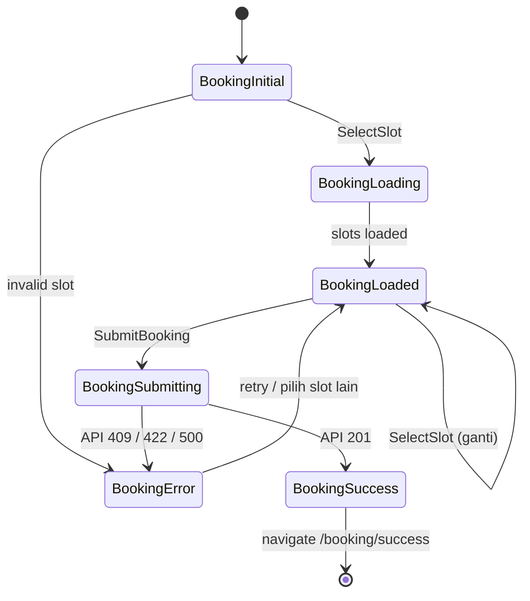
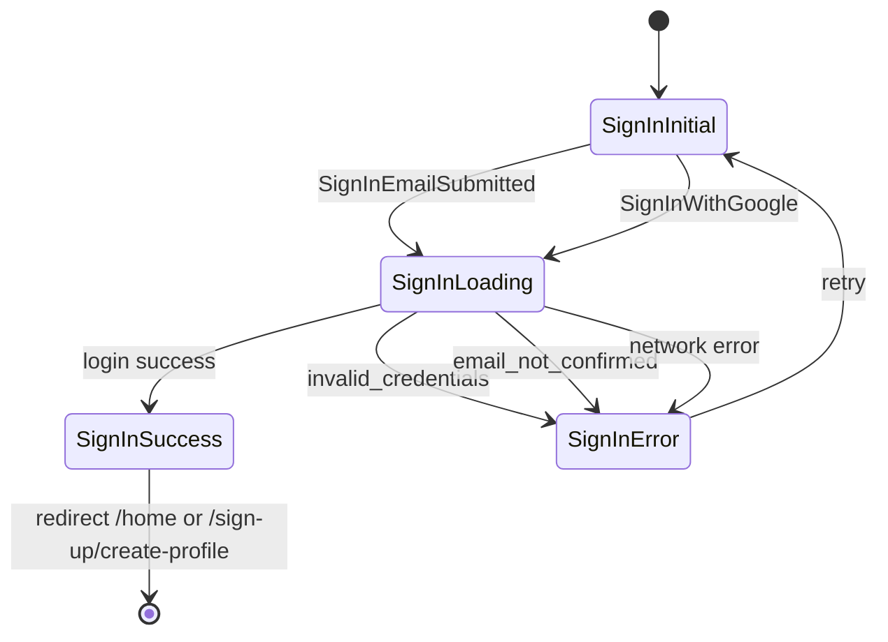
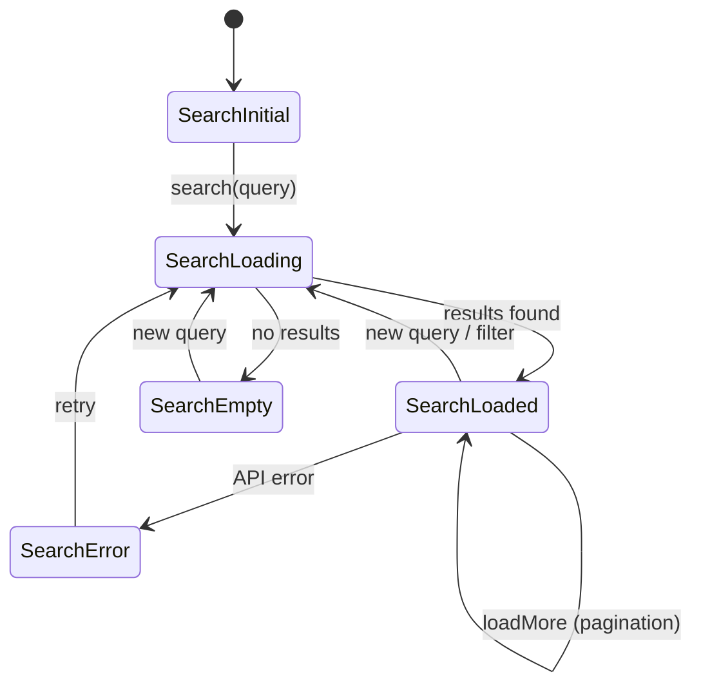

# Technical Design Document — Bagian 4: State Management per Fitur

| Field | Detail |
|---|---|
| **Project** | health_pal |
| **Versi Dokumen** | v1.0 |
| **Tanggal** | Juni 2026 |
| **Acuan** | TDD Bagian 1 (Arsitektur), USER_FLOW v2.0 |

---

## Daftar Isi

1. [Pilihan State Management](#1-pilihan-state-management)
2. [Daftar BLoC/Cubit per Fitur](#2-daftar-bloc-cubit-per-fitur)
3. [State Pattern Template](#3-state-pattern-template)
4. [Spesifikasi BLoC per Fitur](#4-spesifikasi-bloc-per-fitur)
   - 4.1 Auth — Sign In Bloc
   - 4.2 Auth — Sign Up Bloc
   - 4.3 Auth — Forgot Password Cubit
   - 4.4 Auth — Create Profile Cubit
   - 4.5 Onboarding — Onboarding Notifier
   - 4.6 Home — Home Cubit
   - 4.7 Doctor — Search Cubit
   - 4.8 Doctor — Doctor Detail Cubit
   - 4.9 Doctor — Loc Cubit
   - 4.10 Booking — Booking Bloc
   - 4.11 Booking — Booking History Cubit
   - 4.12 Booking — Booking Detail Cubit
   - 4.13 Profile — Profile Cubit
   - 4.14 Profile — Edit Profile Cubit
5. [Diagram Alur State per Fitur Kunci](#5-diagram-alur-state-per-fitur-kunci)

---

## 1. Pilihan State Management

| Tool | Lokasi | Dipakai Untuk |
|---|---|---|
| **flutter_bloc (Bloc)** | `features/{fitur}/presentation/bloc/{nama}_bloc.dart` | Fitur kompleks dengan banyak event |
| **flutter_bloc (Cubit)** | `features/{fitur}/presentation/bloc/{nama}_cubit.dart` | Fitur sederhana, 1-2 method |
| **ChangeNotifier + Provider** | `features/{fitur}/presentation/bloc/{nama}_notifier.dart` | Onboarding (state sangat sederhana) |
| **AppServices** (ChangeNotifier) | `core/services/app_services.dart` | Global AppStatus lifecycle |

### BLoC vs Cubit Decision Tree

```
Apakah fitur punya > 3 jenis interaksi user?
  ├── Ya → Bloc (event-driven)
  └── Tidak → Cubit (method-driven)

Apakah ada validasi/transformasi data kompleks sebelum state berubah?
  ├── Ya → Bloc
  └── Tidak → Cubit
```

---

## 2. Daftar BLoC/Cubit per Fitur

| # | Fitur | Nama | Type | Event / Method |
|---|---|---|---|---|
| 1 | Onboarding | `OnboardingNotifier` | ChangeNotifier | nextPage(), skip() |
| 2 | Sign In | `SignInBloc` | Bloc | 3 event |
| 3 | Sign Up | `SignUpBloc` | Bloc | 1 event |
| 4 | Forgot Password | `ForgotPasswordCubit` | Cubit | 4 method |
| 5 | Create Profile | `CreateProfileCubit` | Cubit | 1 method |
| 6 | Home | `HomeCubit` | Cubit | 3 method |
| 7 | Doctor Search | `SearchCubit` | Cubit | 3 method |
| 8 | Doctor Detail | `DoctorDetailCubit` | Cubit | 4 method |
| 9 | Location Search | `LocCubit` | Cubit | 3 method |
| 10 | Booking | `BookingBloc` | Bloc | 4 event |
| 11 | Booking History | `BookingHistoryCubit` | Cubit | 3 method |
| 12 | Booking Detail | `BookingDetailCubit` | Cubit | 2 method |
| 13 | Profile | `ProfileCubit` | Cubit | 3 method |
| 14 | Edit Profile | `EditProfileCubit` | Cubit | 1 method |

---

## 3. State Pattern Template

Setiap BLoC/Cubit menggunakan sealed class untuk state:

```dart
// Template — semua state per fitur
sealed class FeatureState {
  const FeatureState();
}

class FeatureInitial extends FeatureState {
  const FeatureInitial();
}

class FeatureLoading extends FeatureState {
  const FeatureLoading();
}

class FeatureLoaded extends FeatureState {
  final Data data;
  const FeatureLoaded(this.data);
}

class FeatureError extends FeatureState {
  final Failure failure;
  const FeatureError(this.failure);
}
```

### Standar State Naming

| Nama State | Makna |
|---|---|
| `{Nama}Initial` | Default, belum ada interaksi |
| `{Nama}Loading` | Sedang memuat data (tampilkan shimmer/loader) |
| `{Nama}Loaded` | Data tersedia (tampilkan konten) |
| `{Nama}Error` | Gagal (tampilkan error + retry) |
| `{Nama}Success` | Operasi berhasil (tampilkan konfirmasi) |

---

## 4. Spesifikasi BLoC per Fitur

### 4.1 Auth — Sign In Bloc

**File:** `features/auth/presentation/bloc/sign_in/sign_in_bloc.dart`

**Type:** Bloc (3 event)

```dart
// ── Event ──
sealed class SignInEvent extends Equatable {
  const SignInEvent();
}

class SignInEmailSubmitted extends SignInEvent {
  final String email;
  final String password;
  const SignInEmailSubmitted({required this.email, required this.password});
}

class SignInWithGoogle extends SignInEvent {
  const SignInWithGoogle();
}

class SignInWithFacebook extends SignInEvent {
  const SignInWithFacebook();
}

// ── State ──
sealed class SignInState extends Equatable {
  const SignInState();
}

class SignInInitial extends SignInState {
  const SignInInitial();
}

class SignInLoading extends SignInState {
  const SignInLoading();
}

class SignInSuccess extends SignInState {
  final UserEntity user;
  final bool isProfileComplete;
  const SignInSuccess({required this.user, required this.isProfileComplete});
}

class SignInError extends SignInState {
  final Failure failure;
  const SignInError(this.failure);
}
```

**Logic Flow (Email):**
```
SignInEmailSubmitted
  → validasi email + password (client-side)
  → if invalid → emit SignInError(validationError)
  → if valid → emit SignInLoading
  → LoginWithEmailUseCase.execute(email, password)
    → success → emit SignInSuccess
               → AppServices.login()
               → GoRouter redirect /home (atau /sign-up/create-profile)
    → failure → emit SignInError
```

**Logic Flow (Google):**
```
SignInWithGoogle
  → emit SignInLoading
  → LoginWithEmailUseCase.signInWithGoogle()
    → success → emit SignInSuccess
    → failure → emit SignInError
```

**Dependencies:**
```dart
class SignInBloc extends Bloc<SignInEvent, SignInState> {
  final LoginWithEmailUseCase _loginWithEmail;
  final AppServices _appServices;

  SignInBloc(this._loginWithEmail, this._appServices) : super(SignInInitial()) {
    on<SignInEmailSubmitted>(_onEmailSubmitted);
    on<SignInWithGoogle>(_onGoogleSignIn);
    on<SignInWithFacebook>(_onFacebookSignIn);
  }
}
```

---

### 4.2 Auth — Sign Up Bloc

**File:** `features/auth/presentation/bloc/sign_up/sign_up_bloc.dart`

**Type:** Bloc (1 event)

```dart
// ── Event ──
class SignUpSubmitted extends SignUpEvent {
  final String name;
  final String email;
  final String password;
}

// ── State ──
sealed class SignUpState extends Equatable { ... }
class SignUpInitial extends SignUpState { ... }
class SignUpLoading extends SignUpState { ... }
class SignUpSuccess extends SignUpState {
  final String email;
  final String password;
  final String name;
}
class SignUpError extends SignUpState {
  final Failure failure;
}
```

**Logic Flow:**
```
SignUpSubmitted
  → validasi client-side
  → emit SignUpLoading
  → SignUpUseCase.execute(name, email, password)
    → success → emit SignUpSuccess(email, password, name)
               → context.push('/sign-up/create-profile', extra: data)
    → failure → emit SignUpError(failure)
```

---

### 4.3 Auth — Forgot Password Cubit

**File:** `features/auth/presentation/bloc/forgot_password/forgot_password_cubit.dart`

**Type:** Cubit ✅ Existing

```dart
// ── State (step-based, bukan loading/loaded) ──
enum ForgotPasswordStep { initial, verify, newPassword }

class ForgotPasswordState extends Equatable {
  final ForgotPasswordStep step;
  const ForgotPasswordState(this.step);
}

// ── Methods ──
class ForgotPasswordCubit extends Cubit<ForgotPasswordState> {
  Future<void> sendEmail(String email, {void Function()? onSuccess}) async { ... }
  Future<void> verifyCode(String code, {void Function()? onSuccess}) async { ... }
  Future<void> resetPassword(String password, {void Function()? onSuccess}) async { ... }
  void back() { ... }  // ke step sebelumnya
}
```

**Step Transition:**
```
initial (email)  → sendEmail sukses  → verify (OTP)
verify (OTP)     → verifyCode sukses → newPassword
newPassword      → resetPassword sukses → pop ke /sign-in
verify           → back() → initial
newPassword      → back() → verify
```

---

### 4.4 Auth — Create Profile Cubit

**File:** `features/auth/presentation/bloc/create_profile/create_profile_cubit.dart`

**Type:** Cubit

```dart
// ── State ──
sealed class CreateProfileState extends Equatable { ... }
class CreateProfileInitial extends CreateProfileState { ... }
class CreateProfileSaving extends CreateProfileState { ... }
class CreateProfileSuccess extends CreateProfileState { ... }
class CreateProfileError extends CreateProfileState {
  final Failure failure;
}

// ── Methods ──
class CreateProfileCubit extends Cubit<CreateProfileState> {
  Future<void> saveProfile({
    required String name,
    required String email,
    required String nickname,
    required String gender,
    File? photo,
  }) async { ... }
}
```

**Logic Flow:**
```
saveProfile()
  → validasi form client-side
  → emit CreateProfileSaving
  → upload avatar (jika ada)
  → CreateProfileUseCase.execute(profileData)
    → success → emit CreateProfileSuccess
               → AppServices.login() → redirect /home
    → failure → emit CreateProfileError
```

---

### 4.5 Onboarding — Onboarding Notifier

**File:** `features/onboarding/presentation/bloc/onboarding_notifier.dart`

**Type:** ChangeNotifier ✅ Existing

```dart
class OnboardingNotifier extends ChangeNotifier {
  final PageController pageController = PageController();
  int currentIndex = 0;

  void nextPage() { ... }
  void skip() { ... }  // → completeOnboarding → redirect /sign-in
}
```

**Not using BLoC karena:** State sangat sederhana (hanya currentIndex), tidak ada async operation.

---

### 4.6 Home — Home Cubit

**File:** `features/home/presentation/bloc/home_cubit.dart`

**Type:** Cubit

```dart
// ── State ──
class HomeState extends Equatable {
  final List<BannerEntity> banners;
  final AppointmentEntity? upcoming;
  final List<SpecializationEntity> specializations;
  final bool isLoading;
  final Failure? error;
}

// ── Methods ──
class HomeCubit extends Cubit<HomeState> {
  Future<void> loadData() async { ... }     // load banners + upcoming + categories
  Future<void> refresh() async { ... }      // pull to refresh
}
```

**Data Loading:**
```
loadData()
  → emit(state.copyWith(isLoading: true))
  → parallel: getBanners, getUpcoming, getSpecializations
    → success → emit(state.copyWith(data, isLoading: false))
    → failure → emit(state.copyWith(error, isLoading: false))
```

---

### 4.7 Doctor — Search Cubit

**File:** `features/doctor/presentation/bloc/search/search_cubit.dart`

**Type:** Cubit

```dart
// ── State ──
class SearchState extends Equatable {
  final String query;
  final String? specializationId;
  final List<DoctorEntity> doctors;
  final bool isLoading;
  final bool hasMore;
  final Failure? error;
}

// ── Methods ──
class SearchCubit extends Cubit<SearchState> {
  Future<void> search(String query) async { ... }
  void filterBySpecialization(String? specializationId) { ... }
  Future<void> loadMore() async { ... }      // infinite scroll
}
```

**Search with Debounce:**
```
User mengetik "bud"
  → Debouncer(300ms).run(() => searchCubit.search("bud"))
  → SearchCubit.search("budi")  // jika user lanjut ketik dalam 300ms, cancel previous
  → GET /rest/v1/doctors?full_name=ilike.*budi*
  → emit(SearchState(doctors: result, isLoading: false))
```

---

### 4.8 Doctor — Doctor Detail Cubit

**File:** `features/doctor/presentation/bloc/detail/doctor_detail_cubit.dart`

**Type:** Cubit

```dart
// ── State ──
class DoctorDetailState extends Equatable {
  final DoctorEntity? doctor;
  final DateTime selectedDate;
  final List<DoctorSlotEntity> slots;
  final bool isLoadingDoctor;
  final bool isLoadingSlots;
  final Failure? error;
}

// ── Methods ──
class DoctorDetailCubit extends Cubit<DoctorDetailState> {
  Future<void> loadDoctorDetail(String doctorId) async { ... }
  Future<void> selectDate(DateTime date) async { ... }   // ganti tanggal → refetch slots
  void selectSlot(String slotId) { ... }                  // highlight slot (local state)
}
```

**Logic Flow:**
```
loadDoctorDetail(id)
  → parallel: getDoctorDetail(id), getSlots(id, today)
  → emit loaded state

selectDate(date)
  → getSlots(doctorId, date)
  → emit updated slots
```

---

### 4.9 Doctor — Loc Cubit

**File:** `features/doctor/presentation/bloc/location/loc_cubit.dart`

**Type:** Cubit

```dart
// ── State ──
class LocState extends Equatable {
  final double? latitude;
  final double? longitude;
  final String? city;
  final String? specializationId;
  final double radiusKm;
  final List<DoctorEntity> doctors;
  final bool isLoading;
  final bool hasLocationPermission;
  final Failure? error;
}

// ── Methods ──
class LocCubit extends Cubit<LocState> {
  Future<void> requestLocationPermission() async { ... }
  Future<void> searchByLocation() async { ... }
  void filterBySpecialization(String? specializationId) { ... }
}
```

---

### 4.10 Booking — Booking Bloc

**File:** `features/booking/presentation/bloc/booking/booking_bloc.dart`

**Type:** Bloc (4 event) — karena ada multiple interaksi sebelum submit

```dart
// ── Event ──
sealed class BookingEvent extends Equatable { ... }

class SelectSlot extends BookingEvent {
  final String slotId;
  final DateTime date;
}

class UpdateComplaint extends BookingEvent {
  final String complaint;
}

class SubmitBooking extends BookingEvent {
  // data dari state
}

class ResetBooking extends BookingEvent { }

// ── State ──
class BookingState extends Equatable {
  final String? selectedSlotId;
  final DateTime? selectedDate;
  final String complaint;
  final bool isSubmitting;
  final bool isSuccess;
  final Failure? error;
}
```

**Logic Flow:**
```
SelectSlot → state.copyWith(selectedSlotId, selectedDate)
UpdateComplaint → state.copyWith(complaint)

SubmitBooking
  → validasi: slot harus terpilih, complaint max 300
  → emit(state.copyWith(isSubmitting: true))
  → CreateAppointmentUseCase.execute(doctorId, slotId, complaint)
    → success → emit(state.copyWith(isSuccess: true))
               → push /booking/success
    → failure → emit(state.copyWith(error, isSubmitting: false))
```

**Perbedaan dengan Cubit:** Digunakan Bloc karena `SubmitBooking` perlu membaca state terbaru (selectedSlotId, complaint) dan event dapat di-track secara terpisah.

---

### 4.11 Booking — Booking History Cubit

**File:** `features/booking/presentation/bloc/history/booking_history_cubit.dart`

**Type:** Cubit

```dart
// ── State ──
class BookingHistoryState extends Equatable {
  final String? statusFilter;          // null = all, "pending", "upcoming", etc
  final List<AppointmentEntity> appointments;
  final bool isLoading;
  final bool hasMore;
  final Failure? error;
}

// ── Methods ──
class BookingHistoryCubit extends Cubit<BookingHistoryState> {
  Future<void> loadHistory() async { ... }
  void filterByStatus(String? status) async { ... }
  Future<void> loadMore() async { ... }
}
```

**Filter Behavior:**
```
filterByStatus("pending")
  → emit(state.copyWith(isLoading: true, statusFilter: "pending"))
  → GET /rest/v1/appointments?patient_id=&status=eq.pending
  → emit(loaded)

→ Kembali ke "Semua":
filterByStatus(null)
  → GET /rest/v1/appointments?patient_id= (tanpa filter status)
```

---

### 4.12 Booking — Booking Detail Cubit

**File:** `features/booking/presentation/bloc/detail/booking_detail_cubit.dart`

**Type:** Cubit

```dart
// ── State ──
class BookingDetailState extends Equatable {
  final AppointmentEntity? appointment;
  final bool isCancelling;
  final bool isCancelled;
  final Failure? error;
}

// ── Methods ──
class BookingDetailCubit extends Cubit<BookingDetailState> {
  Future<void> loadDetail(String appointmentId) async { ... }
  Future<void> cancelAppointment(String reason) async { ... }
}
```

**Cancel Logic:**
```
cancelAppointment(reason)
  → emit(state.copyWith(isCancelling: true))
  → CancelAppointmentUseCase.execute(appointmentId, reason)
    → success → emit(state.copyWith(isCancelled: true, isCancelling: false))
               → pop + refresh history
    → failure → emit(state.copyWith(error, isCancelling: false))
```

---

### 4.13 Profile — Profile Cubit

**File:** `features/profile/presentation/bloc/profile_cubit.dart`

**Type:** Cubit

```dart
// ── State ──
class ProfileState extends Equatable {
  final ProfileEntity? profile;
  final bool isLoading;
  final Failure? error;
}

// ── Methods ──
class ProfileCubit extends Cubit<ProfileState> {
  Future<void> loadProfile() async { ... }
  Future<void> toggleNotification(bool enabled) async { ... }
  Future<void> logout() async { ... }
}
```

---

### 4.14 Profile — Edit Profile Cubit

**File:** `features/profile/presentation/bloc/edit_profile_cubit.dart`

**Type:** Cubit

```dart
// ── State ──
class EditProfileState extends Equatable {
  final bool isSaving;
  final bool isSaved;
  final Failure? error;
}

// ── Methods ──
class EditProfileCubit extends Cubit<EditProfileState> {
  Future<void> saveProfile(ProfileEntity updatedProfile, File? photo) async { ... }
}
```

---

## 5. Diagram Alur State per Fitur Kunci

### 5.1 Booking Flow — Full State Machine



### 5.2 Auth Flow — Sign In State Machine



### 5.3 Search Flow — State Machine



---

## Summary

| Fitur | Type | State Count | Async | Dependencies |
|---|---|---|---|---|
| Onboarding | ChangeNotifier | 1 | ❌ | AppServices |
| Sign In | Bloc | 4 | ✅ | LoginWithEmailUseCase, AppServices |
| Sign Up | Bloc | 4 | ✅ | SignUpUseCase |
| Forgot Password | Cubit | 1 (step enum) | ✅ | ForgotPasswordUseCase |
| Create Profile | Cubit | 4 | ✅ | CreateProfileUseCase, AppServices |
| Home | Cubit | 1 (data class) | ✅ | GetBannersUseCase, GetUpcomingUseCase, GetSpecializationsUseCase |
| Search | Cubit | 1 (data class) | ✅ | SearchDoctorsUseCase |
| Doctor Detail | Cubit | 1 (data class) | ✅ | GetDoctorDetailUseCase, GetSlotsUseCase |
| Loc | Cubit | 1 (data class) | ✅ | SearchByLocationUseCase |
| Booking | Bloc | 1 (data class) | ✅ | CreateAppointmentUseCase |
| Booking History | Cubit | 1 (data class) | ✅ | GetBookingHistoryUseCase |
| Booking Detail | Cubit | 1 (data class) | ✅ | GetBookingDetailUseCase, CancelAppointmentUseCase |
| Profile | Cubit | 1 (data class) | ✅ | GetProfileUseCase, LogoutUseCase |
| Edit Profile | Cubit | 4 | ✅ | UpdateProfileUseCase, UploadAvatarUseCase |

---

*Dokumen ini adalah living document. Setiap perubahan state management harus di-update di sini sebelum implementasi.*
