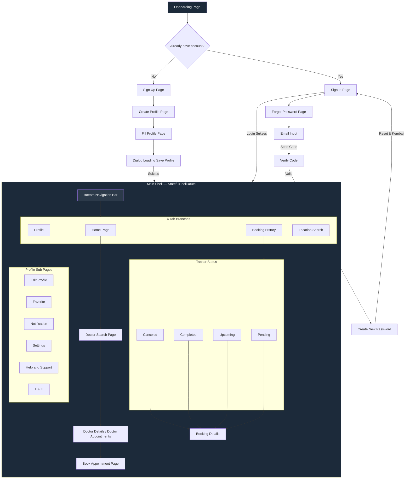
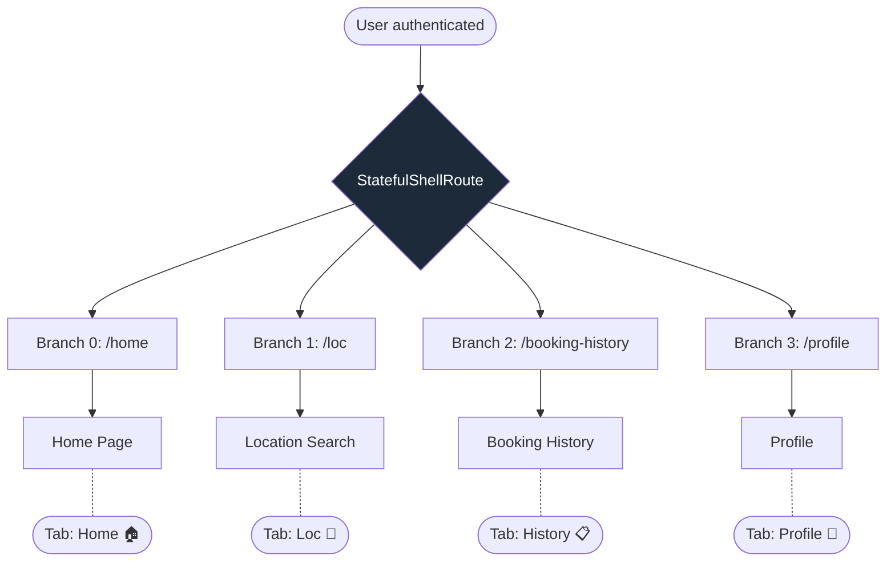

# User Flow — health_pal

| Field | Detail |
|---|---|
| **Project** | health_pal |
| **Platform** | Mobile — Flutter (Android & iOS) |
| **Versi Dokumen** | v2.0 |
| **Tanggal** | Juni 2026 |
| **Acuan** | PRD v1.0, ERD v1.0, API Contract v1.0 |
| **GoRouter Base** | `lib/core/router/app_router.dart` |

---

## Daftar Isi

1. [Hirarki Halaman](#1-hirarki-halaman)
2. [App Launch & Session Resolve](#2-app-launch--session-resolve)
3. [Onboarding Flow](#3-onboarding-flow)
4. [Authentication Flows](#4-authentication-flows)
   - 4.1 Sign In Flow
   - 4.2 Sign Up → Create Profile → Fill Profile → Dialog Loading
   - 4.3 Forgot Password (Email Input → Verify Code → Create New Password)
5. [Main Shell — Bottom Navigation Bar](#5-main-shell--bottom-navigation-bar)
   - 5.1 Home Page → Doctor Search → Doctor Detail → Book Appointment
   - 5.2 Location Search
   - 5.3 Booking History (Tabbar) → Booking Details
   - 5.4 Profile (Edit Profile, Favorite, Notification, Settings, Help & Support, T&C)
6. [GoRouter Code Preview](#6-gorouter-code-preview)

---

## 1. Hirarki Halaman

Hierarki berikut WAJIB direfleksikan di konfigurasi GoRouter:

```
Onboarding Page
├── Sign In Page
│   └── Forgot Password Page
│       ├── Email Input
│       ├── Verify Code
│       └── Create New Password
├── Sign Up Page
│   └── Create Profile Page
│       └── Fill Profile Page
│           └── Dialog Loading Save Profile

─── Batas autentikasi ───

Main Shell (StatefulShellRoute — Bottom Navigation Bar)
├── Home Page
│   └── Doctor Search Page
│       └── Doctor Details / Doctor Appointments
│           └── Book Appointment Page
├── Location Search
├── Booking History
│   ├── Tabbar: Pending
│   ├── Tabbar: Upcoming
│   ├── Tabbar: Completed
│   ├── Tabbar: Canceled
│   │   └── Booking Details
└── Profile
    ├── Edit Profile
    ├── Favorite
    ├── Notification
    ├── Settings
    ├── Help and Support
    └── T & C
```



---

## 2. App Launch & Session Resolve

**Screen A:** App Cold Start → Native Splash  
**Screen B:** Onboarding / Sign In / Home (depending on session)

**Trigger:** User tap icon aplikasi.

```mermaid
graph TD
    A([App Cold Start]) --> B[Native Splash Screen]
    B --> C{AppServices.init}
    C -->|onboardingDone = false| ONB[/onboarding]
    C -->|onboardingDone = true & isLoggedIn = false| SIGNIN[/sign-in]
    C -->|onboardingDone = true & isLoggedIn = true| D{Token valid?}

    D -->|Ya| HOME[/home]
    D -->|Tidak| E[Auto Refresh Token]
    E -->|Sukses| HOME
    E -->|Gagal| SIGNIN

    C -->|Offline| NOINT[/no-internet]
    NOINT -->|Tap "Coba Lagi"| C

    style A fill:#1C2A3A,color:#fff
    style B fill:#1C2A3A,color:#fff
    style NOINT fill:#FF6B6B,color:#fff
```

---

## 3. Onboarding Flow

**Screen A:** Onboarding Page  
**Screen B:** Sign In Page

**Trigger:** User swipe atau tap "Next" / "Skip".

```mermaid
graph TD
    A([onboardingDone = false]) --> B[Onboarding - Slide 1]

    B -->|Swipe kiri / Tap Next| C[Onboarding - Slide 2]
    B -->|Tap Skip| E[completeOnboarding]

    C -->|Swipe kiri / Tap Next| D[Onboarding - Slide 3]
    C -->|Tap Skip| E

    D -->|Tap Get Started| E
    D -->|Tap Skip| E

    E --> F[set onboardingDone = true]
    F -->|Redirect| SIGNIN[/sign-in]

    style A fill:#1C2A3A,color:#fff
    style SIGNIN fill:#4CAF50,color:#fff
```

| Node | Trigger | Route |
|---|---|---|
| Onboarding Slide 1 | Swipe kiri / Tap Next | `/onboarding` (index 0) |
| Onboarding Slide 2 | Swipe kiri / Tap Next | `/onboarding` (index 1) |
| Onboarding Slide 3 | Swipe kiri / Tap "Get Started" / "Skip" | `/onboarding` (index 2) |
| Sign In Page | Redirect otomatis | `/sign-in` |

---

## 4. Authentication Flows

### 4.1 Sign In Flow

**Screen A:** Sign In Page  
**Screen B:** Main Shell → Home Page

**Trigger:** User isi email + password, tap "Sign In". Atau tap Google / Facebook.

```mermaid
graph TD
    SIGNIN([User di /sign-in]) --> METHOD{Metode login}

    %% ─── EMAIL PASSWORD ───
    METHOD -->|"Email + Password"| FORM[Isi email + password]
    FORM --> VALIDATE{Tap Sign In}
    VALIDATE -->|Validasi gagal| ERR[Error per field]
    ERR --> FORM
    VALIDATE -->|Validasi lolos| LOAD[Loading Dialog]
    LOAD --> API[POST /auth/v1/token?grant_type=password]

    API -->|200| SESSION[AppServices.login → authenticated]
    API -->|400 email_not_confirmed| DIALOG1[Dialog: "Verifikasi email dulu"]
    API -->|400 invalid_credentials| SNACK1[Snackbar: Email/password salah]
    API -->|422| SNACK2[Snackbar: Format tidak valid]
    API -->|Network error| SNACK3[Snackbar: Periksa koneksi]

    DIALOG1 --> FORM
    SNACK1 --> FORM
    SNACK2 --> FORM
    SNACK3 --> FORM

    SESSION --> PROFIL{is_profile_complete?}
    PROFIL -->|true| HOME[/home]
    PROFIL -->|false| CREATE[/sign-up/create-profile]

    %% ─── GOOGLE ───
    METHOD -->|"Google"| GOOGLE[Tap Sign In with Google]
    GOOGLE --> OAUTH[OAuth Google]
    OAUTH -->|Sukses| SESSION
    OAUTH -->|Gagal| SNACK4[Snackbar: Login Google gagal]
    SNACK4 --> SIGNIN

    %% ─── FACEBOOK ───
    METHOD -->|"Facebook"| FB[Tap Sign In with Facebook]
    FB --> FB_IMPL{Diimplementasikan?}
    FB_IMPL -->|Tidak v1.0| SNACK5[Snackbar: Fitur belum tersedia]
    SNACK5 --> SIGNIN

    %% ─── FORGOT PASSWORD ───
    METHOD -->|"Forgot password?"| FORGOT[/sign-in/forgot-password]

    style SIGNIN fill:#1C2A3A,color:#fff
    style HOME fill:#4CAF50,color:#fff
    style SNACK3 fill:#FF6B6B,color:#fff
```

### 4.2 Sign Up → Create Profile → Fill Profile → Dialog Loading

**Screen A:** Sign Up Page  
**Screen B:** Main Shell → Home Page

**Trigger:** User isi nama, email, password, tap "Create Account".

```mermaid
graph TD
    SIGNUP([User di /sign-up]) --> FORM[Isi Nama, Email, Password]

    FORM --> TAP{Tap "Create Account"}
    TAP -->|Validasi gagal| ERR[Error per field + dialog]
    ERR --> FORM

    TAP -->|Validasi lolos| REGIS[POST /auth/v1/signup]

    REGIS -->|201 Sukses| PASS[Simpan data ke extra params]
    REGIS -->|422 password too short| ERR1[Error: Password minimal 8 karakter]
    REGIS -->|400 user_already_exists| ERR2[Error: Email sudah terdaftar]
    REGIS -->|Network error| ERR3[Snackbar: Periksa koneksi]

    ERR1 --> FORM
    ERR2 --> FORM
    ERR3 --> FORM

    PASS --> CREATE[/sign-up/create-profile]

    %% ─── CREATE PROFILE → FILL PROFILE ───
    CREATE --> FILL[Fill Profile Page]
    FILL --> INPUT[Form: Foto, Nickname, Tgl Lahir, Gender]

    INPUT --> SAVE{ Tap "Save Profile" }
    SAVE -->|Validasi gagal| ERR4[Highlight error]
    ERR4 --> INPUT
    SAVE -->|Validasi lolos| DIALOG[Dialog Loading Save Profile]

    DIALOG --> API[POST /rest/v1/user_profiles]

    API -->|201 Sukses| AUTHED[AppServices.login → authenticated]
    API -->|Error| ERR5[Snackbar: Gagal simpan profil]
    ERR5 --> INPUT

    AUTHED --> HOME[/home]

    %% Back
    FILL -->|Tap back| BACK_CONFIRM{Konfirmasi kembali?}
    BACK_CONFIRM -->|Ya| SIGNUP
    BACK_CONFIRM -->|Tidak| FILL

    style SIGNUP fill:#FFA726,color:#fff
    style HOME fill:#4CAF50,color:#fff
    style DIALOG fill:#1C2A3A,color:#fff
```

| Node | Trigger | Route |
|---|---|---|
| Sign Up Page | Tap "Sign up" | `/sign-up` |
| Create Profile Page | Auto setelah register sukses | `/sign-up/create-profile` |
| Fill Profile Page | Isi form (foto, nickname, DOB, gender) | `/sign-up/create-profile` (konten) |
| Dialog Loading Save Profile | Tap "Save Profile" → loading | Overlay, route tetap |
| Home Page | Redirect | `/home` |

### 4.3 Forgot Password — Email Input → Verify Code → Create New Password

**Screen A:** Sign In Page  
**Screen B:** Sign In Page (password berhasil di-reset)

**Trigger:** User tap "Forgot password?".

```mermaid
graph TD
    SIGNIN([Sign In Page]) --> FORGOT[/sign-in/forgot-password]

    FORGOT --> STEP1[Email Input]
    STEP1 --> SEND{Tap Send Code}

    SEND -->|Email tidak valid| ERR1[Error: Format email salah]
    ERR1 --> STEP1
    SEND -->|Valid| LOAD1[Loading]
    LOAD1 --> API1[POST /auth/v1/recover]

    API1 -->|200| STEP2[Verify Code / OTP 5-digit]
    API1 -->|Network error| ERR2[Snackbar: Cek koneksi]
    ERR2 --> STEP1

    STEP2 --> VERIFY{Tap Verify Code}
    VERIFY -->|OTP < 5 digit| ERR3[Error: OTP tidak valid]
    ERR3 --> STEP2
    VERIFY -->|OTP valid| API2[Verify OTP server]

    API2 -->|Sukses| STEP3[Create New Password]
    API2 -->|OTP salah| ERR4[Error: Kode verifikasi salah]
    API2 -->|OTP expired| ERR5[Error: Kode expired, kirim ulang]
    ERR4 --> STEP2
    ERR5 --> STEP2

    STEP3 --> INPUT[Input password baru + konfirmasi]
    INPUT --> RESET{Tap Reset Password}

    RESET -->|Password != Confirm| ERR6[Error: Konfirmasi tidak cocok]
    ERR6 --> INPUT
    RESET -->|Valid| API3[Reset password API]

    API3 -->|Sukses| POPUP[Popup sukses → auto dismiss]
    API3 -->|Error| ERR7[Snackbar: Gagal reset]
    ERR7 --> INPUT

    POPUP --> BACK[context.pop → /sign-in]

    %% Back navigasi
    STEP2 -->|Tap back| FORGOT
    STEP3 -->|Tap back| STEP2

    style SIGNIN fill:#1C2A3A,color:#fff
    style BACK fill:#4CAF50,color:#fff
    style ERR5 fill:#FF6B6B,color:#fff
```

| Node (Step) | Trigger | Route | Cubit Step |
|---|---|---|---|
| Email Input | Tap "Forgot password?" | `/sign-in/forgot-password` | `ForgotPasswordStep.initial` |
| Verify Code (OTP) | API sukses kirim kode | `/sign-in/forgot-password` | `ForgotPasswordStep.verify` |
| Create New Password | OTP valid | `/sign-in/forgot-password` | `ForgotPasswordStep.newPassword` |
| Kembali ke Sign In | Reset sukses | context.pop → `/sign-in` | — |

> **Catatan:** Ketiga sub-step (Email Input, Verify Code, Create New Password) berada di **satu halaman/rute yang sama** (`/sign-in/forgot-password`). Perpindahan antar-step dikelola oleh `ForgotPasswordCubit` di layer BLoC, bukan oleh GoRouter.

---

## 5. Main Shell — Bottom Navigation Bar

**Struktur Wajib:** `StatefulShellRoute.indexedStack` dengan 4 branch.



| Tab | Route | Branch Index | Icon |
|---|---|---|---|
| Home | `/home` | 0 | 🏠 |
| Location Search | `/loc` | 1 | 📍 |
| Booking History | `/booking-history` | 2 | 📋 |
| Profile | `/profile` | 3 | 👤 |

---

### 5.1 Home Page → Doctor Search → Doctor Detail → Book Appointment

**Screen A:** Home Page (dalam Shell)  
**Screen B:** Book Appointment Page (push di atas shell)

**Trigger:** User mencari dokter dari Home → pilih → detail → booking.

```mermaid
graph TD
    HOME([Home Page — /home]) --> SEARCH_TRIGGER{Metode cari}

    SEARCH_TRIGGER -->|Tap search bar| INPUT[Input keyword nama / spesialisasi]
    SEARCH_TRIGGER -->|Tap kategori cepat| SEARCH_PAGE

    INPUT --> API_SEARCH[GET /rest/v1/doctors?full_name=ilike.*keyword*]
    API_SEARCH -->|200 hasil| SEARCH_PAGE[Doctor Search Page]
    API_SEARCH -->|200 kosong| EMPTY[Empty: Dokter tidak ditemukan]
    API_SEARCH -->|Timeout| SLOW[Snackbar: Pencarian lambat]
    SLOW --> INPUT

    SEARCH_PAGE -->|Tap card| DETAIL[/doctor/:doctorId]
    DETAIL --> API_DETAIL[GET doctor detail + slot]

    API_DETAIL -->|200| DETAIL_SCREEN[Doctor Details / Doctor Appointments]
    API_DETAIL -->|404| NOTFOUND[Dialog: Dokter tidak ditemukan]
    NOTFOUND -->|OK| HOME

    DETAIL_SCREEN --> PICK_TGL{Pilih tanggal}
    PICK_TGL --> DATE_PICKER[Horizontal date picker, 7 hari]
    DATE_PICKER --> API_SLOT[GET slot: is_booked = false]

    API_SLOT -->|Ada slot| SLOT_AVAIL[Slot chips: hijau = avail, abu = booked]
    API_SLOT -->|Kosong| NO_SLOT[Empty: Tidak ada jadwal]
    NO_SLOT --> PICK_TGL

    SLOT_AVAIL -->|Tap slot & Book| BOOK[/booking/:doctorId]
    BOOK --> FORM[Pilih slot + isi complaint note]
    FORM --> CONFIRM{Ringkasan + Tap Konfirmasi}

    CONFIRM -->|Complaint > 300 char| COMP_ERR[Error: Maks 300 karakter]
    COMP_ERR --> FORM
    CONFIRM -->|Konfirmasi| BS[BSheet Konfirmasi Booking]
    BS -->|Tap Konfirmasi Booking| API_BOOK[POST /functions/v1/create-appointment]

    API_BOOK -->|201| SUCCESS[Booking Berhasil → /booking/success]
    API_BOOK -->|409| CONFLICT[Dialog: Slot sudah dipesan]
    API_BOOK -->|500| RETRY[Dialog: Coba lagi]
    API_BOOK -->|Network| NET_ERR[Snackbar: Periksa koneksi]

    CONFLICT --> PICK_TGL
    RETRY --> BS
    NET_ERR --> BS

    SUCCESS --> FCM[FCM: Booking berhasil]
    FCM -->|Tap Kembali| HOME

    %% Offline handling
    INPUT -->|Offline| NO_INT[/no-internet]
    API_DETAIL -->|Offline| NO_INT
    API_SLOT -->|Offline| NO_INT
    API_BOOK -->|Offline| NO_INT

    style HOME fill:#1C2A3A,color:#fff
    style SUCCESS fill:#4CAF50,color:#fff
    style NO_INT fill:#FF6B6B,color:#fff
```

| Node | Trigger | Route |
|---|---|---|
| Home Page | — | `/home` (tab 0) |
| Doctor Search Page | Tap search bar / kategori | `/doctor/search` (push) |
| Doctor Details / Doctor Appointments | Tap card dokter | `/doctor/:doctorId` (push) |
| Book Appointment Page | Tap "Book Appointment" | `/booking/:doctorId` (push) |
| Booking Berhasil | API sukses → snackbar/dialog | `/booking/success` (push) |

---

### 5.2 Location Search

**Screen A:** Location Search Tab (dalam Shell)  
**Screen B:** Doctor Details (push)

**Trigger:** User tap tab Location Search di bottom nav.

```mermaid
graph TD
    LOC([Location Search — /loc]) --> IZIN{Izin lokasi?}
    IZIN -->|Diberikan| MAP[Google Maps + pin klinik]
    IZIN -->|Ditolak| FALLBACK[Input kota manual]

    MAP --> FILTER[Filter chips: spesialisasi, jarak, rating]
    FALLBACK --> FILTER

    FILTER --> API_LOC[POST /functions/v1/doctors-by-location]
    API_LOC -->|200 hasil| LIST[List dokter + jarak]
    API_LOC -->|200 kosong| EMPTY[Empty: Tidak ada dokter]
    API_LOC -->|Invalid radius| RADIUS_ERR[Set ke default 5km]
    RADIUS_ERR --> API_LOC

    LIST -->|Pull to refresh| REFRESH[Refresh data]
    LIST -->|Tap card| DETAIL[/doctor/:doctorId]

    style LOC fill:#1C2A3A,color:#fff
```

| Node | Trigger | Route |
|---|---|---|
| Location Search | Tap tab ke-2 | `/loc` (tab 1) |
| Doctor Details | Tap card dokter | `/doctor/:doctorId` (push) |

---

### 5.3 Booking History — Tabbar → Booking Details

**Screen A:** Booking History Tab (dalam Shell)  
**Screen B:** Booking Details (push)

**Trigger:** User tap tab Booking History di bottom nav.

```mermaid
graph TD
    HIST([Booking History — /booking-history]) --> TABBAR{Tabbar Status}

    TABBAR -->|Pending| PEND[Card: status kuning]
    TABBAR -->|Upcoming| UPCOM[Card: status hijau]
    TABBAR -->|Completed| COMP[Card: status biru]
    TABBAR -->|Canceled| CANC[Card: status merah/abu]

    PEND -->|Tap card| DETAIL[/booking-history/:appointmentId]
    UPCOM -->|Tap card| DETAIL
    COMP -->|Tap card| DETAIL
    CANC -->|Tap card| DETAIL

    DETAIL --> BOOKDETAIL[Booking Details]

    BOOKDETAIL --> STATUS{Status apa?}
    STATUS -->|Pending / Upcoming| BTN_CANCEL[Tombol "Batalkan" muncul]
    STATUS -->|Completed / Canceled| BTN_HIDDEN[Tombol "Batalkan" tidak muncul]

    BTN_CANCEL -->|Tap Batalkan| CONFIRM[Dialog konfirmasi]
    CONFIRM -->|Ya| API_CANCEL[POST /functions/v1/cancel-appointment]
    CONFIRM -->|Tidak| TUTUP[Tutup dialog]

    API_CANCEL -->|200| FCM_CANCEL[FCM + pop → list]
    API_CANCEL -->|403| FORBID[Snackbar: Bukan appt kamu]
    API_CANCEL -->|422| INVALID[Snackbar: Status tidak bisa dibatalkan]
    API_CANCEL -->|Network| NET_ERR[Snackbar: Cek koneksi]

    FORBID --> BOOKDETAIL
    INVALID --> BOOKDETAIL
    NET_ERR --> BOOKDETAIL

    HIST -->|Pull to refresh| REFRESH[Refresh list + status badge]
    REFRESH --> TABBAR

    %% Edge case: expired saat dilihat
    BOOKDETAIL -->|Waktu slot lewat| EXPIRED[Dialog: Appointment sudah lewat]
    EXPIRED --> AUTO_REFRESH[Refresh → status = completed]
    AUTO_REFRESH --> pop[pop → /booking-history]

    style HIST fill:#1C2A3A,color:#fff
    style CANC fill:#FF6B6B,color:#fff
```

| Node | Trigger | Route |
|---|---|---|
| Booking History | Tap tab ke-3 | `/booking-history` (tab 2) |
| Tabbar Pending | Tap chip "Pending" | `/booking-history` (filter state) |
| Tabbar Upcoming | Tap chip "Upcoming" | `/booking-history` (filter state) |
| Tabbar Completed | Tap chip "Completed" | `/booking-history` (filter state) |
| Tabbar Canceled | Tap chip "Canceled" | `/booking-history` (filter state) |
| Booking Details | Tap card appointment | `/booking-history/:appointmentId` (push) |

---

### 5.4 Profile — Sub Pages

**Screen A:** Profile Tab (dalam Shell)  
**Screen B:** Edit Profile / Favorite / Notification / Settings / Help & Support / T&C (push)

**Trigger:** User tap tab Profile di bottom nav, lalu tap menu item.

```mermaid
graph TD
    PROF([Profile — /profile]) --> MENU{Menu}

    MENU -->|Tap Edit Profile| EDIT[/profile/edit]
    MENU -->|Tap Favorite| FAV[/profile/favorite]
    MENU -->|Tap Notification| NOTIF[/profile/notification]
    MENU -->|Tap Settings| SET[/profile/settings]
    MENU -->|Tap Help and Support| HELP[/profile/help]
    MENU -->|Tap T & C| TNC[/profile/tnc]

    MENU -->|Toggle Notifikasi| TOGGLE[Update notif_reminder_enabled]

    MENU -->|Tap Logout| LOGOUT_DIALOG[Dialog: "Yakin logout?"]
    LOGOUT_DIALOG -->|Ya| LOGOUT_API[AppServices.logout → unauthenticated]
    LOGOUT_DIALOG -->|Tidak| TUTUP_DIALOG[Tutup dialog]

    LOGOUT_API --> REDIRECT[/sign-in]

    %% Edit Profile sub-flow
    EDIT --> EDIT_FORM[Form: foto, nama, nickname, tgl lahir, gender]
    EDIT_FORM --> EDIT_SAVE{Tap Save}
    EDIT_SAVE -->|Validasi lolos| EDIT_API[PATCH /rest/v1/user_profiles]
    EDIT_SAVE -->|Validasi gagal| EDIT_ERR[Error per field]
    EDIT_ERR --> EDIT_FORM
    EDIT_API -->|200| EDIT_SUKSES[Snackbar: Profil tersimpan]
    EDIT_API -->|Error| EDIT_FAIL[Snackbar: Gagal simpan]
    EDIT_FAIL --> EDIT_FORM

    style PROF fill:#1C2A3A,color:#fff
    style REDIRECT fill:#FF6B6B,color:#fff
```

| Node | Trigger | Route |
|---|---|---|
| Profile | Tap tab ke-4 | `/profile` (tab 3) |
| Edit Profile | Tap menu "Edit Profile" | `/profile/edit` (push) |
| Favorite | Tap menu "Favorite" | `/profile/favorite` (push) |
| Notification | Tap menu "Notification" | `/profile/notification` (push) |
| Settings | Tap menu "Settings" | `/profile/settings` (push) |
| Help and Support | Tap menu "Help and Support" | `/profile/help` (push) |
| T & C | Tap menu "T & C" | `/profile/tnc` (push) |

---

## 6. GoRouter Code Preview

Berikut konfigurasi rute GoRouter yang merefleksikan seluruh hirarki di atas. Path dan `name` siap dipakai di kode asli.

```dart
// lib/core/router/app_router.dart

import 'package:go_router/go_router.dart';
import 'package:injectable/injectable.dart';

@lazySingleton
class AppRouter {
  final AppServices _appServices;

  AppRouter(this._appServices);

  late final router = GoRouter(
    initialLocation: '/onboarding',
    refreshListenable: _appServices,
    redirect: (context, state) {
      final status = _appServices.status;
      final loc = state.uri.path;
      final isAuthRoute = loc.startsWith('/sign-in') || loc.startsWith('/sign-up');

      if (status == AppStatus.onboarding) {
        return loc == '/onboarding' ? null : '/onboarding';
      }
      if (status == AppStatus.unauthenticated) {
        return isAuthRoute ? null : '/sign-in';
      }
      if (status == AppStatus.authenticated) {
        if (isAuthRoute || loc == '/onboarding') return '/home';
      }
      return null;
    },
    routes: [
      // ═══════════════════════════════════════════
      // PRE-AUTH ROUTES
      // ═══════════════════════════════════════════
      GoRoute(
        path: '/onboarding',
        name: 'onboarding',
        builder: (_, __) => const OnboardingPage(),
      ),
      GoRoute(
        path: '/sign-in',
        name: 'signIn',
        builder: (_, __) => const SignInPage(),
        routes: [
          GoRoute(
            path: 'forgot-password',
            name: 'forgotPassword',
            builder: (_, __) => const ForgotPasswordPage(),
            // Sub-step (Email → Verify → New Password)
            // dikelola oleh ForgotPasswordCubit di dalam halaman,
            // bukan oleh GoRouter.
          ),
        ],
      ),
      GoRoute(
        path: '/sign-up',
        name: 'signUp',
        builder: (_, __) => const SignUpPage(),
        routes: [
          GoRoute(
            path: 'create-profile',
            name: 'createProfile',
            builder: (context, state) {
              final data = state.extra as Map<String, dynamic>?;
              return CreateProfilePage(
                email: data?['email'] ?? '',
                password: data?['password'] ?? '',
                fullname: data?['name'] ?? '',
              );
            },
            // Fill Profile Page adalah konten dari CreateProfilePage
            // Dialog Loading Save Profile adalah overlay dialog
          ),
        ],
      ),

      // ═══════════════════════════════════════════
      // MAIN SHELL — BOTTOM NAVIGATION
      // ═══════════════════════════════════════════
      StatefulShellRoute.indexedStack(
        builder: (_, __, navigationShell) => AppShell(
          navigationShell: navigationShell,
        ),
        branches: [
          // ── Tab 0: Home Page ──
          StatefulShellBranch(
            routes: [
              GoRoute(
                path: '/home',
                name: 'home',
                builder: (_, __) => const HomePage(),
              ),
            ],
          ),
          // ── Tab 1: Location Search ──
          StatefulShellBranch(
            routes: [
              GoRoute(
                path: '/loc',
                name: 'locationSearch',
                builder: (_, __) => const LocPage(),
              ),
            ],
          ),
          // ── Tab 2: Booking History ──
          StatefulShellBranch(
            routes: [
              GoRoute(
                path: '/booking-history',
                name: 'bookingHistory',
                builder: (_, __) => const BookingHistoryPage(),
              ),
            ],
          ),
          // ── Tab 3: Profile ──
          StatefulShellBranch(
            routes: [
              GoRoute(
                path: '/profile',
                name: 'profile',
                builder: (_, __) => const ProfilePage(),
              ),
            ],
          ),
        ],
      ),

      // ═══════════════════════════════════════════
      // STACK ROUTES (push di atas Shell, bottom nav tersembunyi)
      // ═══════════════════════════════════════════

      // ── Doctor Search & Booking ──
      GoRoute(
        path: '/doctor/search',
        name: 'doctorSearch',
        builder: (_, __) => const DoctorSearchPage(),
        // parentRoute: '/home', // implicit — navigasi dari Home
      ),
      GoRoute(
        path: '/doctor/:doctorId',
        name: 'doctorDetail',
        builder: (_, state) => DoctorDetailPage(
          doctorId: state.pathParameters['doctorId']!,
        ),
      ),
      GoRoute(
        path: '/booking/:doctorId',
        name: 'bookAppointment',
        builder: (_, state) => BookAppointmentPage(
          doctorId: state.pathParameters['doctorId']!,
        ),
      ),
      GoRoute(
        path: '/booking/success',
        name: 'bookingSuccess',
        builder: (_, __) => const BookingSuccessPage(),
      ),

      // ── Booking Details ──
      GoRoute(
        path: '/booking-history/:appointmentId',
        name: 'bookingDetail',
        builder: (_, state) => BookingDetailPage(
          appointmentId: state.pathParameters['appointmentId']!,
        ),
      ),

      // ── Profile Sub Pages ──
      GoRoute(
        path: '/profile/edit',
        name: 'editProfile',
        builder: (_, __) => const EditProfilePage(),
      ),
      GoRoute(
        path: '/profile/favorite',
        name: 'favorite',
        builder: (_, __) => const FavoritePage(),
      ),
      GoRoute(
        path: '/profile/notification',
        name: 'notification',
        builder: (_, __) => const NotificationPage(),
      ),
      GoRoute(
        path: '/profile/settings',
        name: 'settings',
        builder: (_, __) => const SettingsPage(),
      ),
      GoRoute(
        path: '/profile/help',
        name: 'helpSupport',
        builder: (_, __) => const HelpSupportPage(),
      ),
      GoRoute(
        path: '/profile/tnc',
        name: 'termsAndConditions',
        builder: (_, __) => const TermsAndConditionsPage(),
      ),

      // ── Utility ──
      GoRoute(
        path: '/no-internet',
        name: 'noInternet',
        builder: (_, __) => const NoInternetPage(),
      ),
    ],
  );
}
```

### Ringkasan Path & Name

| Path | Name | Parent | Status |
|---|---|---|---|
| `/onboarding` | `onboarding` | — | ✅ Existing |
| `/sign-in` | `signIn` | — | ✅ Rename from `/login` |
| `/sign-in/forgot-password` | `forgotPassword` | Sign In | ✅ Existing |
| `/sign-up` | `signUp` | — | ✅ Existing |
| `/sign-up/create-profile` | `createProfile` | Sign Up | ✅ Existing |
| `/home` | `home` | Shell (tab 0) | ✅ Existing (stub) |
| `/loc` | `locationSearch` | Shell (tab 1) | 🔧 Proposed |
| `/booking-history` | `bookingHistory` | Shell (tab 2) | 🔧 Proposed |
| `/profile` | `profile` | Shell (tab 3) | 🔧 Proposed |
| `/doctor/search` | `doctorSearch` | Stack | 🔧 Proposed |
| `/doctor/:doctorId` | `doctorDetail` | Stack | 🔧 Proposed |
| `/booking/:doctorId` | `bookAppointment` | Stack | 🔧 Proposed |
| `/booking/success` | `bookingSuccess` | Stack | 🔧 Proposed |
| `/booking-history/:appointmentId` | `bookingDetail` | Stack | 🔧 Proposed |
| `/profile/edit` | `editProfile` | Stack | 🔧 Proposed |
| `/profile/favorite` | `favorite` | Stack | 🔧 Proposed |
| `/profile/notification` | `notification` | Stack | 🔧 Proposed |
| `/profile/settings` | `settings` | Stack | 🔧 Proposed |
| `/profile/help` | `helpSupport` | Stack | 🔧 Proposed |
| `/profile/tnc` | `termsAndConditions` | Stack | 🔧 Proposed |
| `/no-internet` | `noInternet` | Stack | 🔧 Proposed |

---

*Dokumen ini adalah living document. Setiap perubahan navigasi atau penambahan flow baru harus diupdate di sini sebelum implementasi.*
